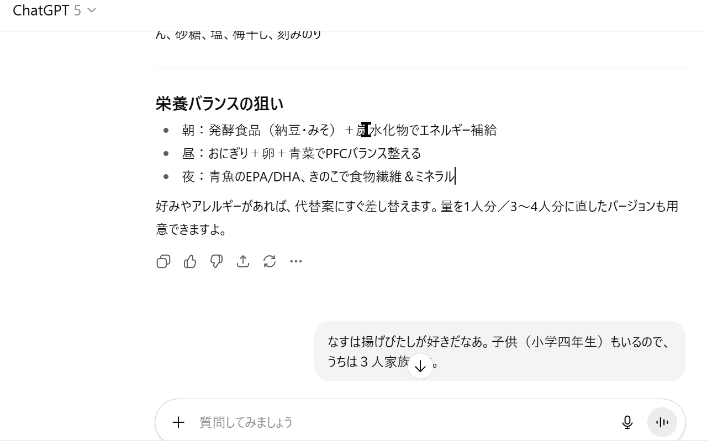

# ChatGPT JumpBack

Quickly jump back to the last place you were reading after ChatGPT auto-scrolls to the bottom.

## What It Solves

- When you send a prompt, ChatGPT scrolls to the end. JumpBack records the closest visible message (near the viewport center) so you can instantly return without losing context.

## How It Works

- Records on send (Enter or Send button) or when clicking the "scroll to latest/bottom" UI.
- Jumps back to the recorded message via icon click, keyboard shortcut, or the page context menu.

---

## Features

- Auto-record on:
  - Enter (without Shift) to send
  - Clicking the Send button
  - Clicking the "scroll to latest/bottom" UI (broad detection to avoid misses)
- Jump back via:
  - Extension icon click
  - Keyboard shortcut
  - Page context menu (on ChatGPT only, when enabled)
- Icon behavior:
  - Extension ON: icon is colored
  - Extension OFF: icon is gray
  - On non-ChatGPT sites, actions do nothing even if the icon is colored
- Options page:
  - Toggle "Enable ChatGPT JumpBack" (persists across browser restarts)
- Context menus:
  - Action icon (right-click): Open info (GitHub), Enable/Disable
  - Page (right-click on ChatGPT only, when enabled): "Return to last reading position"
- Keyboard shortcut:
  - Default: Alt+J (mac: Alt+Shift+J). Change at chrome://extensions/shortcuts

---

## Installation (Developer Mode)

1. Download this repository (Code -> Download ZIP), then unzip.
2. Open Chrome -> `chrome://extensions/`.
3. Enable Developer mode (top-right).
4. Click "Load unpacked" and select the unzipped folder.
5. Pin the extension if you want quick access.

---

## Usage

- While reading, send a prompt (Enter without Shift or click Send) or click the "scroll to latest/bottom" UI.
- The extension records the closest visible message (near viewport center).
- Jump back:
  - Click the extension icon, or
  - Use the shortcut (Alt+J; mac: Alt+Shift+J), or
  - Right-click the page (on ChatGPT) -> "Return to last reading position"

Tip: Recording has a small 200ms debounce to avoid accidental duplicates.

---

## Settings

- Open the options page:
  - `chrome://extensions/` -> this extension -> "Extension options"
- Toggle "Enable ChatGPT JumpBack"
  - ON: Colored icon; features enabled on ChatGPT pages
  - OFF: Gray icon; features disabled

The ON/OFF setting persists across restarts.

---

## Permissions and Scope

- Permissions: `contextMenus`, `tabs`, `storage`, `scripting`
- Content script runs only on:
  - `https://chat.openai.com/*`
  - `https://chatgpt.com/*`
- Host permissions (for injecting into already-open tabs):
  - `https://chat.openai.com/*`
  - `https://chatgpt.com/*`
- No network requests or analytics. Storage is used only for the ON/OFF setting.
- Not affiliated with, endorsed, or sponsored by OpenAI or ChatGPT.

---

## Notes and Limitations

- Relies on ChatGPT's DOM structure and detects `div[data-message-author-role]`.
- ChatGPT is a SPA; UI changes may break selectors. If it stops working, update the selector.
- "Scroll to latest" detection uses a broad fallback to reduce missed detections (especially on mobile). In rare cases it may trigger on unrelated buttons due to UI changes; this is a trade‑off that favors reliability over misses. If you notice unexpected behavior, please open an issue and we will refine the detection.

---

## Troubleshooting

- Icon doesn't change after toggling in Settings:
  - Reload the extension at `chrome://extensions/` if needed.
  - Icon shows colored only when the extension is ON.
- No jump:
  - Ensure you're on a ChatGPT page.
  - Check the page console for logs like `[ChatGPT JumpBack] content loaded` and `record/jump`.
- Shortcut doesn't fire:
  - Set/change it at `chrome://extensions/shortcuts`.
  - On macOS, the default is Alt+Shift+J to avoid text input conflicts.

---

## Disclaimer

- This is an **unofficial tool created by an individual developer**.
- It is not an official OpenAI feature or extension.
- Use at your own risk and responsibility.
- The script does not interact with OpenAI’s models, algorithms, or servers. It only manipulates the visible DOM elements on the page.

## License

MIT License

---

## Links

- Project (GitHub): https://github.com/wanyakomochimochi/ChatGPTJumpBack
- Extension (Chrome Web Store): https://chromewebstore.google.com/detail/chatgpt-jumpback/aadmenichpgbodjbkpenadnmngpanloh?hl=en

---
